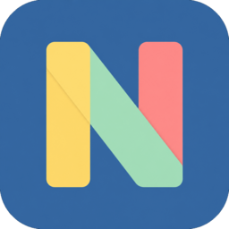
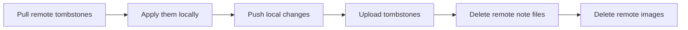

<div align="center">



# NoteNest

**Your notes live on your device. Your GitHub repository is the only server.**

A local-first notes & checklists app for **Windows** and **Android**, built with Flutter.

[Features](#features) ·
[Quick start](#quick-start) ·
[Build from source](#build-from-source) ·
[Setting up sync](#setting-up-sync) ·
[Privacy](#privacy) ·
[Contributing](/CONTRIBUTING.md) ·
[FAQ](#faq)

[](https://github.com/hamamun/NoteNest/releases)
[](/LICENSE)
[](https://github.com/hamamun/NoteNest/actions/workflows/ci.yml)
[](https://docs.flutter.dev/get-started/install)
[](#build-from-source)
[](https://github.com/hamamun/NoteNest/releases)
[](/CONTRIBUTING.md)

</div>

---

NoteNest is a note-taking and to-do app that keeps **no cloud account, no
subscription and no analytics**. Every note is written to a local SQLite
database first, so the app is fully usable on a plane, in a tunnel, or with
Wi-Fi switched off. When you *choose* to sync, the app pushes your notes as
plain Markdown files into a **private GitHub repository that you own**.

```text
Windows (local SQLite) ◄──────► your private GitHub repo ◄──────► Android (local SQLite)
                                 notes/*.md · images/ · backups/
     ▲ offline-first: each device is complete on its own — sync is an optimisation ▲
```

That single design decision gives you five things most note apps don't:

| | |
|---|---|
| **You own the data** | Your notes are files in a Git repo you can clone, back up, mirror to GitLab, or `git log` through time. |
| **No lock-in** | Notes are Markdown with YAML front matter. They are readable on github.com and importable into Obsidian, Joplin, Logseq or a plain text editor. |
| **No server to trust** | NoteNest makes exactly one network call: `api.github.com`. There is no NoteNest backend, no telemetry, no sign-up. |
| **Free sync** | A private repo and a fine-grained token. No per-seat pricing, no storage cap that matters for text. |
| **Deleting means deleting** | Tombstones stop a note you deleted from being resurrected by a device that was offline. This is the hard part of local-first, and it is unit-tested exhaustively. |

---

## Features

### Writing
- **Notes and checklists** side by side in one searchable workspace
- **View / Edit modes** — a note renders as calm content, and edits without a mode-switch flicker
- **Checkmarks survive re-typing**: a text-based matching rule keeps an item's checked state even when the wording or the order changes
- **Markdown preview** (headings, bold, italics, code, lists) — a self-contained renderer, no discontinued packages
- **Images**: attach from disk or camera, stored locally and mirrored to the repo with thumbnails
- **Clickable links** in note text, and a **"keep screen awake"** toggle for reading on a phone
- **Colours**, four card layouts (grid / list / compact / rows), five sort modes, and an adjustable text size
- **Pin, Archive, Trash** — plus a search box scoped to whichever workspace you are in

### Privacy lock
- Optional **4-digit PIN** that hides notes, lists, or both — on *this device only*
- Auto-lock after **1, 5 or 15 minutes**; closing the app locks instantly
- Archive and Trash deliberately stay open, so you can always dig up old work

### Sync & backup
- **Bidirectional sync** with a private GitHub repository over the Contents API
- **Auto-sync** on launch, when the network comes back, and every 3 minutes
  while the app is in the foreground — plus one manual tap of the cloud button
- **Conflict-safe**: two devices editing the same note keeps *both* versions, one clearly labelled — it never silently overwrites
- **Scheduled backups** (weekly/monthly) as dated `.zip` archives inside the repo, plus a manual save-to-disk
- **Optional AES-256-GCM encrypted backups** (PBKDF2-derived key) and **optional encrypted note bodies** in the repo
- **PDF and TXT export**, with a font slot for non-Latin scripts

### Under the hood
- `drift` / SQLite, `flutter_secure_storage` for the token, no ORM magic, no Firebase
- Redacting logger: a GitHub token can never leak into a log line
- Refuses to sync to a **public** repository (checked against the API, not the UI text)
- 228 tracked requirements, 5 unit-test files covering the logic that is expensive to get wrong
- Continuous integration runs `flutter analyze` + `flutter test` on Linux and
  Windows, and tagged builds produce a Windows installer and an Android APK

---

## Quick start

### 1. Get the app

Grab the newest build from [**Releases**](https://github.com/hamamun/NoteNest/releases):

| File | Platform | Install |
|------|----------|---------|
| `NoteNest-Setup-1.0.0.exe` | Windows 10/11 x64 | Run it — installs per-user, no admin rights needed |
| `app-release.apk` | Android 5.0+ (API 21) | Enable "install unknown apps", or sideload with `adb install -r` |

Windows builds are **not code-signed**, so SmartScreen will warn once:
*More info → Run anyway*. The APK is a release build signed with Flutter's
debug key (this project ships no signing key, because your keystore should be
yours), so install it by sideloading rather than through an app store. Prefer
building it yourself? See below — that is the whole point of open source.

### 2. Write something

Nothing to configure. Notes are saved to a local SQLite database as you type
and the app works entirely offline.

### 3. Turn on sync (optional, ~3 minutes)

Follow [Setting up sync](#setting-up-sync) to point the app at your own private
GitHub repository and your notes will start following you between devices.

---

## Build from source

### Prerequisites

| Need | Notes |
|------|-------|
| **Flutter ≥ 3.22** (stable) | Works with any newer version. Easiest install: the [Flutter VS Code extension](https://marketplace.visualstudio.com/items?itemName=Dart-Code.flutter) → command palette → **Flutter: New Project** → **Download SDK**. Manual steps: [docs.flutter.dev/install/manual](https://docs.flutter.dev/install/manual) |
| **Android SDK** | Via Android Studio — only for the Android build |
| **Visual Studio 2022 Build Tools** | With *"Desktop development with C++"* — only for the Windows build |
| **Git** | The setup script restores files with `git checkout` |

To run only the tests you need Flutter — no Android SDK, no Build Tools.

### Clone and set up

```bash
git clone https://github.com/hamamun/NoteNest.git
cd NoteNest
```

This repository holds the **app source only**. The `android/` and `windows/`
runner folders are generated by Flutter and are therefore git-ignored, so the
first step creates them:

**Windows (PowerShell, from the repository root)**

```powershell
powershell -ExecutionPolicy Bypass -File tool\setup.ps1
```

**Linux / macOS**

```bash
bash tool/setup.sh
```

Both scripts run `flutter create` for Windows + Android, restore the NoteNest
source over Flutter's templates, add the Android `INTERNET` permission, fetch
packages, generate the Drift database code and launcher icons, then run
`flutter analyze` and `flutter test`. They are idempotent — re-run them any
time a `flutter create` wipes a runner folder.

<details>
<summary><strong>Manual setup, if you prefer to type it yourself</strong></summary>

```bash
flutter create . --project-name notenest --org com.notenest --platforms=windows,android
git checkout -- lib pubspec.yaml analysis_options.yaml test   # undo template overwrites
flutter pub get
dart run build_runner build --delete-conflicting-outputs      # REQUIRED: generates database.g.dart
dart run flutter_launcher_icons                               # REQUIRED: app icon (Windows + Android)
cp assets/icon/app_icon.ico windows/runner/resources/app_icon.ico   # multi-size Windows icon
flutter analyze
flutter test
```

> `dart run build_runner build` is not optional. Drift generates
> `lib/data/db/database.g.dart` from the table definitions, and the app will
> not compile until that file exists.

</details>

### Run

```bash
flutter run -d windows
flutter devices && flutter run -d <android-device-id>
```

### Build release artifacts

```bash
flutter build windows          # build\windows\x64\runner\Release\
flutter build apk --release    # build\app\outputs\flutter-apk\
```

Optional Windows installer (needs [Inno Setup 6](https://jrsoftware.org/isinfo.php)):

```powershell
iscc tool\windows_installer.iss    # -> dist\NoteNest-Setup-1.0.0.exe
```

### Tests

```bash
flutter test
```

| File | Covers |
|------|--------|
| `test/checklist_matcher_test.dart` | the text-based checked-state rule, duplicates, unicode |
| `test/sync_decision_test.dart` | the anti-resurrection invariant across all 32 input combinations |
| `test/entry_file_codec_test.dart` | every synced field round-trips, including awkward content |
| `test/core_test.dart` | ULID, token redaction, backup crypto, export filenames |
| `test/pin_lock_test.dart` | PIN hash, lock targets, auto-lock timer, session close |

### Continuous integration

The workflow definitions live in [`tool/ci/`](/tool/ci) rather than
`.github/workflows/`, because GitHub only accepts new workflow files from an
account with the `workflows` permission. Two commands turn them on:

```bash
mkdir -p .github/workflows
git mv tool/ci/ci.yml tool/ci/build.yml .github/workflows/
git commit -m "ci: enable the CI and release-build workflows"
```

[`tool/ci/README.md`](/tool/ci/README.md) documents what each job proves and
why the release build produces **unsigned** artifacts on purpose. The CI badge
at the top of this file starts reporting once those files are in place.

---

## Setting up sync

1. On GitHub, create a **private** repository (for example `NoteNest-Sync`).
2. Create a **fine-grained personal access token**:
   *Settings → Developer settings → Personal access tokens → Fine-grained tokens*
   - Repository access: **Only select repositories** → your notes repository
   - Permissions: **Contents: Read and write**, **Metadata: Read**
   - Expiration: **set one.** NoteNest does not yet warn you when it expires —
     a sync failure with a `401` means "paste a fresh token", and *Settings →
     GitHub sync → Replace* is all it takes.
3. In NoteNest: **Settings → GitHub sync** → enter owner, repository, branch →
   paste the token → **Test connection** → **Save and enable**.

The app **refuses to enable sync on a public repository**, and the token is
kept in Windows Credential Manager / the Android Keystore — never in the
database, never in a file, never in a log.

### What your repository looks like

```text
notes/<entry-id>.md              one Markdown file per note or list
images/<image-id>.jpg
thumbnails/<image-id>.jpg
.tombstones/entries/<id>.json    delete records
backups/{weekly,monthly,manual}/
```

A note file is ordinary Markdown, so it stays readable on github.com and
recoverable even if NoteNest itself disappears:

```markdown
---
id: 01JZ8Q2M7X...
type: checklist
title: Packing
colour: amber
pinned: false
updated_at: 2026-08-27T09:14:02Z
---

Passport
Sunglasses [x]
Book [ ]
```

### How deletes stay deleted

The hardest problem in multi-device local-first apps is a deleted note coming
back to life because another device was offline when you deleted it. NoteNest
solves it with tombstones:

- every permanent delete writes a tombstone **before** anything is destroyed
- **sync always fetches tombstones before pushing anything** — the order is fixed and commented in `sync_engine.dart`
- a tombstone beats the note file, the local row and the images
- a tombstoned id is never uploaded again (proven by a test over all 32 input combinations of the decision table)
- if a device had edited that note while offline, the work is preserved as a **new** recovered copy rather than resurrecting the original id



---

## Privacy

| Question | Answer |
|---|---|
| Where do my notes live? | In a SQLite file inside the app's private storage on your device. |
| What leaves the device? | Nothing, until you configure sync. Afterwards, only your own private GitHub repository. |
| Which hosts are contacted? | `api.github.com` — that is the only outbound host in `lib/`. |
| Analytics / telemetry / crash reporting? | None. There is no Firebase, Sentry, admob or tracking SDK in `pubspec.yaml`. |
| Account required? | No. GitHub is optional and is *your* repository. |
| Where is the token stored? | OS keychain (`flutter_secure_storage`). The logger redacts anything shaped like a GitHub token. |
| Can I read my data without the app? | Yes — plain Markdown and JPG files in Git, plus dated ZIP backups. |
| Deleted from the repo? | Latest files are removed, but old content can remain in Git history. Use encrypted sync if that matters to you. |
| On-device secrecy? | The PIN lock is a screen-lock, not disk encryption. A determined attacker with root access reads the SQLite file. Encrypted backups are the tool for that threat. |

---

## Project layout

```text
lib/
  app/          shell, theme, brand mark, icons, colour picker, service wiring
  core/         ULID, time, hashing, crypto, redacting logger
  data/
    db/             Drift schema (entries, checklist_items, images, tombstones…)
    models/         enums (self-stable string values)
    repositories/   entry repository, checklist matcher, settings, secure store
  features/
    home/       card grid, search, filters, multi-select, create flow
    item/       view/edit modes, checklist, image strip, linkified text
    export/     PDF + TXT export
    backup/     zip snapshots, optional encryption, Markdown folder import
    lock/       PIN pad, policy, lifecycle
    settings/   appearance, sync, backup, about
    sync/       GitHub client, file codec, decision table, engine, controller
test/           5 suites — matcher, sync decision, codec, core, PIN lock
tool/           setup.ps1 / setup.sh, Inno Setup script
docs/           design plan, requirements audit, master build checklist
```

### App icon

The launcher icon — an "N" monogram of pastel sticky-note bars on brand blue —
lives in `assets/icon/`:

- `app_icon.png` — 1024×1024 design master
- `app_icon_ui.png` — same art with a transparent field, used inside the app
- `app_icon_launcher.png` — full-bleed blue square for Windows/Android mipmaps
- `app_icon_adaptive_fg.png` — Android adaptive foreground, pre-scaled into the 66% safe zone
- `app_icon.ico` — multi-size Windows icon (16→256 px)

`flutter create` regenerates platform folders with Flutter's default icons, so
re-run `dart run flutter_launcher_icons` (or the setup script) afterwards.
Windows caches the old taskbar icon until you unpin NoteNest or restart Explorer.

---

## Limitations (v1.0.0, stated plainly)

- **Restore from backup is not built yet.** A backup is a recovery archive: unzip it and re-import through *Settings → Markdown folder*.
- **PDF fonts.** PDF export uses a built-in Latin font offline. For Bengali, Hindi, Arabic or CJK glyphs **in exported PDFs**, drop `NotoSans-Regular.ttf` and `NotoSans-Bold.ttf` into `assets/fonts/`, uncomment the four `fonts:` lines in `pubspec.yaml`, and NoteNest picks them up. On-screen text is unaffected — the app renders system fonts fine.
- **No iOS/macOS/Linux runners** in this repo yet. They are one `flutter create --platforms=...` away and the code avoids platform-specific APIs, but they are untested.
- **No incremental note history** — every edit is a new Git commit in your repo, so versioning is Git's job.
- **Windows builds are unsigned** — expect one SmartScreen prompt.

## Roadmap

`v1.1` backup restore · `v1.2` inline images in note bodies · `v1.3` tags and
saved searches · `v2` iOS + macOS runners, E2EE with per-device key exchange,
a local web view of the repo. Pick something from
[open issues](https://github.com/hamamun/NoteNest/issues) — see
[CONTRIBUTING.md](/CONTRIBUTING.md).

---

## FAQ

**Why GitHub instead of WebDAV / Nextcloud / my own server?**
Because Git gives you history, diffs on github.com, free private storage, and
a restore path that does not depend on this app. The sync layer is small
(`github_client.dart`) and speaks the Contents API, so another transport is a
realistic contribution.

**Can I use one repository for several people?**
No. The repo is a single-user mirror; two writers would fight over the same
`notes/` tree. Give each person their own private repo and token.

**Is the sync end-to-end encrypted?**
Optionally, at the note-body level (Settings → *Encrypt notes before upload*),
with a passphrase you choose — plus AES-256-GCM encrypted backups. It is not a
zero-knowledge system: file names and structure stay visible to GitHub.

**What happens if two devices edit the same note offline?**
Both versions are kept; the loser is saved as a clearly labelled conflict copy.
Nothing is merged and nothing is overwritten.

**I lost my PIN.**
The PIN is not recoverable by design — it is salted and hashed, never stored.
Uninstalling the app clears it, so keep a backup zip.

**My token leaked.**
Revoke it on GitHub immediately, then paste a new one in Settings. NoteNest
never writes the token to disk or to the log, so there is nothing else to clean
up on the device.

---

## Contributing

Bugs, docs, translations and PRs are welcome — read
[CONTRIBUTING.md](/CONTRIBUTING.md) first (two rules: keep `flutter analyze`
clean, and never break the tombstone invariant). Small first issues are tagged
[`good first issue`](https://github.com/hamamun/NoteNest/issues?q=is%3Aissue+is%3Aopen+label%3A%22good+first+issue%22).
Please report security problems privately as described in
[SECURITY.md](/SECURITY.md), not in a public issue.

## License

Released under the **MIT License** — see [LICENSE](/LICENSE). You may use,
copy, modify and re-distribute NoteNest, including commercially.

One thing the license does *not* grant: the **name "NoteNest"** and the **N
monogram artwork**, which may not be used to brand or market a derived product.
See [TRADEMARK.md](/TRADEMARK.md). Rename and re-icon your fork — then do with
it whatever you like.

## Acknowledgements

Built with [Flutter](https://flutter.dev) and [Drift](https://drift.simonbinder.eu);
sync against the [GitHub REST API](https://docs.github.com/en/rest).

## Documents

- [`docs/local_first_notes_app_plan.md`](/docs/local_first_notes_app_plan.md) — the full design plan
- [`docs/local_first_notes_app_requirements_audit.md`](/docs/local_first_notes_app_requirements_audit.md) — the frozen requirements
- [`docs/BUILD_CHECKLIST.md`](/docs/BUILD_CHECKLIST.md) — every requirement with an ID, plus the manual QA script
- [CHANGELOG.md](/CHANGELOG.md) · [Roadmap](#roadmap) · [Releases](https://github.com/hamamun/NoteNest/releases)

<div align="center">

**[⬆ back to top](#notenest)**

</div>
